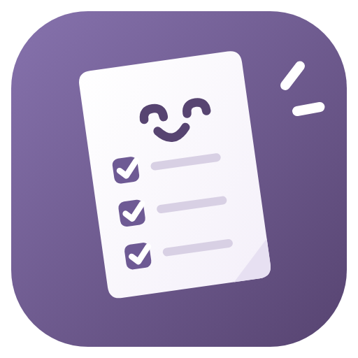
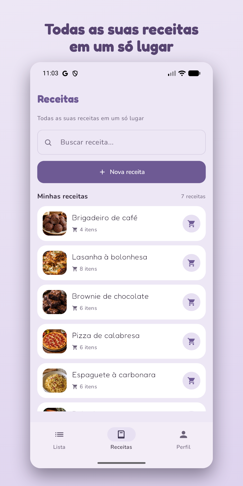
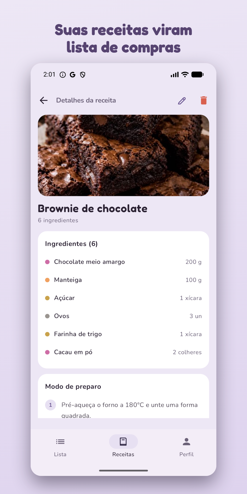
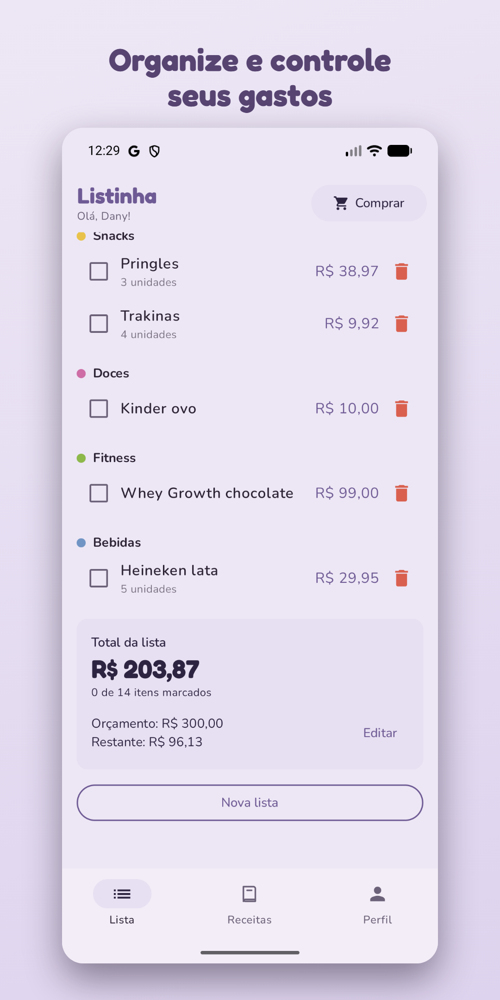
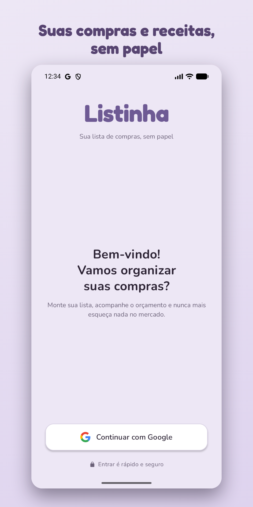
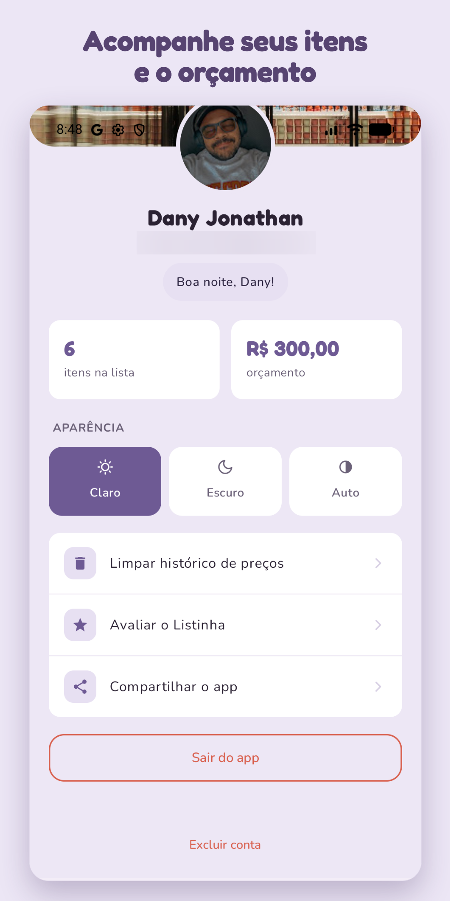
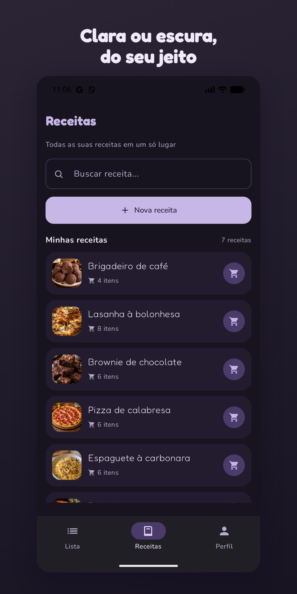

<div align="center">



# Listinha

**Suas receitas viram lista de compras num toque.**

App Android nativo de lista de compras e receitas — organização automática por categoria, controle de gastos em tempo real e um caderno de receitas que faz a compra por você.

<br />


<sub>🚧 Em fase de teste fechado na Google Play — link de download em breve.</sub>

<br />


</div>

<br />

## Sobre o projeto

O **Listinha** é um app Android publicado na **Google Play Store**, feito para quem faz feira e mercado. A ideia nasceu de um problema simples: anotar item por item toda semana é chato e fácil de esquecer algo.

O diferencial está em unir **receitas e lista de compras** no mesmo lugar. Você guarda suas receitas favoritas com foto, ingredientes e modo de preparo — e, quando bate a vontade de cozinhar, um toque em **"Adicionar à lista"** joga todos os ingredientes na sua lista de compras, já organizados por categoria e prontos para o supermercado.

Grátis, sem anúncios, com login pelo Google e sincronização na nuvem.

<br />

## Telas

<div align="center">

<table>
  <tr>
    <td align="center"><br /><sub><b>Suas receitas</b></sub></td>
    <td align="center"><br /><sub><b>Detalhe da receita</b></sub></td>
    <td align="center"><br /><sub><b>Lista + orçamento</b></sub></td>
  </tr>
  <tr>
    <td align="center"><br /><sub><b>Login com Google</b></sub></td>
    <td align="center"><br /><sub><b>Perfil</b></sub></td>
    <td align="center"><br /><sub><b>Modo escuro</b></sub></td>
  </tr>
</table>

</div>

<br />

## Funcionalidades

- 🧾 **Receitas viram lista** — um toque transforma os ingredientes de uma receita em itens da lista de compras.
- 📖 **Caderno de receitas** — foto, ingredientes e modo de preparo, tudo salvo na sua conta.
- 🗂️ **Organização automática** — itens agrupados por categoria (frutas, carnes, mercearia, limpeza e mais).
- 💰 **Controle de gastos** — defina um orçamento e acompanhe o total da compra em tempo real.
- 🛒 **Modo compra** — marque os itens enquanto anda pelo supermercado.
- 🔐 **Login com Google** — dados seguros e sincronizados na nuvem.
- 🌗 **Tema claro e escuro** — visual leve, sem propaganda.

<br />

## Tecnologias

| Camada | Stack |
|--------|-------|
| **Linguagem** | Kotlin |
| **UI** | Jetpack Compose · Material 3 (Material You) |
| **Arquitetura** | MVVM · ViewModel · StateFlow |
| **Autenticação** | Firebase Auth · Credential Manager (login com Google) |
| **Banco de dados** | Cloud Firestore (nuvem, por usuário) |
| **Assíncrono** | Kotlin Coroutines |
| **Imagens** | Coil |
| **Outros** | Splash Screen API · fontes variáveis (Fredoka + Nunito) |

<br />

## Arquitetura

O app segue **MVVM** com uma separação clara entre dados, lógica de tela e interface. A UI é 100% declarativa em Jetpack Compose, e cada tela observa o estado exposto pelo seu `ViewModel`.

```
app/src/main/java/com/listinha/app/
├── auth/            # AuthViewModel — login com Google
├── data/            # Modelos e repositórios (Item, Recipe, Profile, Firestore)
├── list/            # ListViewModel — lista de compras e orçamento
├── recipes/         # RecipeViewModel — receitas
├── ui/
│   ├── components/   # Componentes reutilizáveis (linhas, formulários, resumos)
│   ├── screens/      # Telas (Login, Home, Lista, Receitas, Detalhe, Perfil)
│   └── theme/        # Cores, tipografia e tema (claro/escuro)
└── util/            # Formatação de moeda, utilitários de imagem
```

### Segurança dos dados

Como o app fala direto com o Firestore, a proteção fica nas **regras de segurança**: cada pessoa só acessa a própria "gaveta" (`users/{uid}/...`) e nada além disso.

```js
// firestore.rules
function isOwner(userId) {
  return request.auth != null && request.auth.uid == userId;
}

match /users/{userId} {
  allow read, write: if isOwner(userId);
  match /{document=**} {
    allow read, write: if isOwner(userId);
  }
}
// Qualquer outro caminho fica NEGADO por padrão.
```

<br />

## Como rodar localmente

> O projeto usa Firebase, então precisa das suas próprias credenciais para compilar.

```bash
# 1. Clone o repositório
git clone https://github.com/Danyyks/Listinha-Android.git

# 2. Abra a pasta no Android Studio
```

3. Crie um projeto no [Firebase](https://console.firebase.google.com/), ative **Authentication (Google)** e **Cloud Firestore**.
4. Baixe o `google-services.json` e coloque em `app/`.
5. Publique as regras do arquivo `firestore.rules`.
6. Rode o app (`Shift + F10`).

<br />

## Roadmap

- [ ] **Premium com IA** — geração de receitas e sugestões de compra com IA.
- [ ] Compartilhar listas entre pessoas da casa.
- [ ] Histórico de preços e comparação entre compras.

<br />

## Autor

Feito por **Dany Jonathan Bueno** — estudante de Análise e Desenvolvimento de Sistemas e desenvolvedor em formação.

[](https://linkedin.com/in/danyyjonathan)
[](https://instagram.com/danyyjonathan)
[](mailto:danyy.jonathan@gmail.com)

<br />

<div align="center">
<sub>Listinha · app Android publicado na Google Play · Kotlin + Jetpack Compose + Firebase</sub>
</div>
